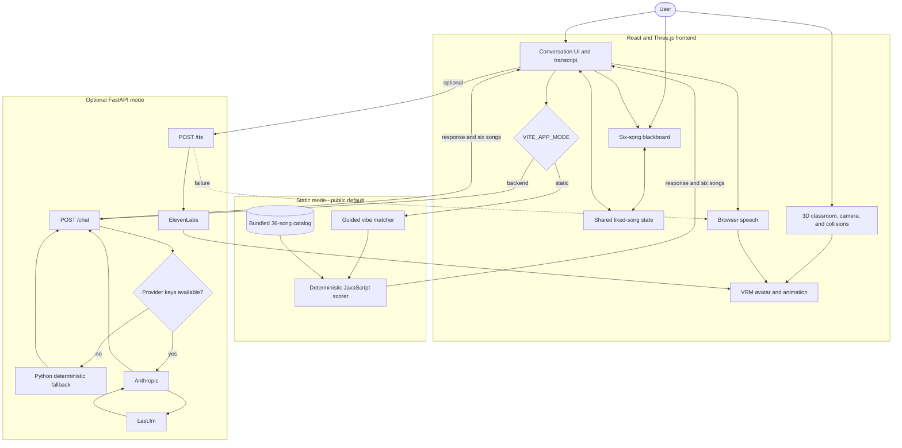

# Resonance Room Architecture

## Release Modes

Resonance Room keeps one frontend and two explicit data paths. The public Render release uses static mode. Backend mode is optional and intended for local development.



## Mode Boundary

| Behavior | Static mode | Backend mode |
| --- | --- | --- |
| Chat source | Six guided vibes and deterministic scoring | FastAPI `/chat` |
| Catalog | 36 bundled JavaScript records | Last.fm when configured, otherwise the 18 records in `data/songs.csv` |
| Network requirement | None for chat | Required to reach FastAPI |
| Default speech | Browser speech | Browser speech or ElevenLabs |
| ElevenLabs | Never requested | FastAPI `/tts` when configured |
| Five-liked-song profile | Creates one session-only summary from catalog attributes | Sends one automatic profile request |
| Public Render release | Yes | No |

Static mode never probes `/tts/available`, sends `/chat`, or requests `/tts`.

## Component Summary

| Component | Role | Location |
| --- | --- | --- |
| Conversation UI | Accepts input and renders Esme's response and transcript | Frontend |
| Recommendation board | Displays six songs and provides raycast hit areas | Frontend |
| Liked-song state | Synchronizes board rows, transcript hearts, and the liked panel | Frontend |
| Avatar | Handles movement, animation, blinking, facial motion, and lip sync | Frontend |
| Classroom | Handles rendering, collisions, camera movement, and occlusion fading | Frontend |
| Static chat client | Routes public requests to the browser fallback without fetching | Frontend |
| Backend chat client | Sends bounded `{role, content}` history to FastAPI | Frontend |
| Browser fallback | Matches guided vibes, avoids recent repeats, and scores the stored catalog | Frontend |
| FastAPI `/chat` | Uses providers when configured and Python fallback otherwise | Backend |
| FastAPI `/tts` | Proxies text to ElevenLabs and returns MP3 audio | Backend |
| FastAPI `/health` | Reports optional backend availability | Backend |
| Python recommender | Scores 18 stored songs and returns six for the product | Backend and evaluation |

## Shared Selection Path

The board and transcript do not keep separate liked-song lists. Both call the same title-and-artist selection helpers. React owns the selected-song array and sends it back to the Three.js board so hover, click, transcript hearts, and the liked panel stay synchronized.

Board selection is available only after Esme moves past the first desk row. A press and release must occur on the same song hit area, and movement beyond the click threshold is treated as camera dragging.

The transcript remains the keyboard-accessible selection method.

## Recommendation Data Flow

### Public static mode

```text
User message
  -> frontend chat client
  -> guided vibe profile
  -> deterministic score over the 36-song bundled catalog
  -> six diverse songs that avoid recent results when alternatives remain
  -> rotating response template and optional session taste note
  -> board, transcript, and optional browser speech
```

### Optional backend mode

```text
User message
  -> frontend chat client
  -> FastAPI /chat
      -> Anthropic and Last.fm when configured
      -> Python keyword profile and scoring fallback otherwise
  -> six songs and response text
  -> optional FastAPI /tts or browser speech
```

## Human Review

Automated tests protect data flow and interaction rules. Manual review is still required for classroom composition, animation quality, camera feel, occlusion fading, speech timing, and the final deployed experience.
