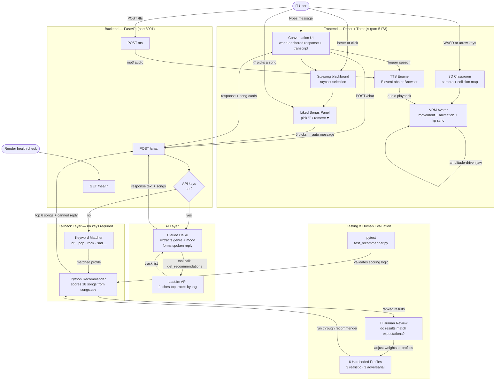

# Resonance Room Architecture

## Architecture Overview



---

## Component Summary

| Component | Role | Type |
| --- | --- | --- |
| **Conversation UI** | Accepts input and renders the current response, transcript, and song cards | Frontend |
| **Liked Songs Panel** | Tracks up to 5 picked songs; triggers profile message | Frontend |
| **Recommendation Board** | Displays six songs and shares selection state with the transcript | Frontend |
| **VRM Avatar** | Moves through the classroom with collision-aware locomotion, animation, blinking, and lip sync | Frontend |
| **Classroom Scene** | Renders the environment, orbit camera, inspection metadata, and collision zones | Frontend |
| **TTS Engine** | Speaks Esme's replies — ElevenLabs (natural) or browser (fallback) | Frontend |
| **FastAPI `/chat`** | Orchestrates Claude + Last.fm or routes to fallback | Backend |
| **FastAPI `/tts`** | Proxies text to ElevenLabs, returns mp3 | Backend |
| **Claude Haiku** | Extracts genre/mood via tool use, forms the spoken reply | AI Agent |
| **Last.fm API** | Retrieves real song recommendations by genre/mood tag | Retriever |
| **Keyword Matcher** | Maps user message words to the closest taste profile | Fallback |
| **Python Recommender** | Scores 18 songs against a profile; the product returns six | Fallback / Evaluator |
| **pytest suite** | Validates sorting, scoring, and explanation logic | Automated Testing |
| **6 Test Profiles** | Covers realistic and adversarial user types | Evaluation |
| **Human Review** | Checks whether ranked results match expected taste | Human-in-the-loop |

---

## Data Flow Summary

```
User message
    → Frontend (Chat UI)
    → Backend /chat
        → [keys set]   Claude extracts genre/mood → Last.fm fetches tracks → Claude forms reply
        → [no keys]    Keyword match → Python Recommender scores songs.csv
    → Response text + song list
    → Frontend renders cards + triggers Esme to speak
    → TTS audio → amplitude-driven lip sync on jaw bone
```

## Where Humans Are Involved

| Touch point | What the human does |
| --- | --- |
| **Chat input** | Sends natural language messages to Esme |
| **Song picks** | Chooses songs they like from recommendation cards |
| **Profile evaluation** | Reviews whether the 6 test profiles return sensible results |
| **Weight tuning** | Adjusts scoring weights in `recommender.py` based on observed bias |
